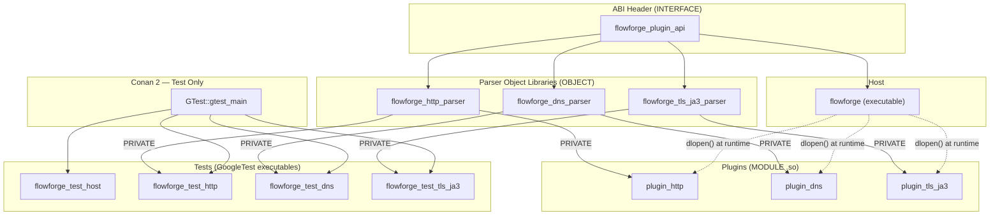

# FlowForge Plugin Host — Architecture Design Document

**Document ID:** FF-DES-001  
**Version:** 0.1.0  
**Date:** 2026-08-02  
**Author:** System Architect Agent  
**Status:** Draft — Ready for Developer Implementation  
**SRS Reference:** FF-SRS-001 v0.1.0  

---

## Table of Contents

1. [Architecture Overview](#1-architecture-overview)
2. [Module Breakdown](#2-module-breakdown)
3. [Public C ABI Design (`plugin_v1.h`)](#3-public-c-abi-design)
4. [Host Binary Design](#4-host-binary-design)
5. [Plugin Implementation Designs](#5-plugin-implementation-designs)
   - [5.1 HTTP Plugin](#51-http-plugin-plugin_http)
   - [5.2 DNS Plugin](#52-dns-plugin-plugin_dns)
   - [5.3 TLS JA3 Plugin](#53-tls-ja3-plugin-plugin_tls_ja3)
6. [CMake Target Structure](#6-cmake-target-structure)
7. [Directory Layout](#7-directory-layout)
8. [Design Decisions & Trade-offs](#8-design-decisions--trade-offs)
9. [Interface Stability Contract](#9-interface-stability-contract)
10. [Risks](#10-risks)
11. [Open Questions Pushed to Developer](#11-open-questions-pushed-to-developer)

---

## 1. Architecture Overview

FlowForge is structured around a stable C ABI boundary. The **host binary** owns the plugin lifecycle (load → init → dispatch → destroy → unload) and never carries protocol-specific code. All protocol intelligence lives in **MODULE shared libraries** that the host discovers and interrogates at runtime via `dlopen`/`dlsym`.

A thin **INTERFACE CMake target** (`flowforge_plugin_api`) owns the sole header that crosses the ABI boundary. Every plugin and the host include this header; nothing else is shared at the binary level.

Parser logic inside each plugin is compiled into an **OBJECT library** so that the same translation units can be linked into both the plugin MODULE and the corresponding GoogleTest executable without code duplication.



Solid arrows = compile-time link dependency. Dashed arrows = runtime `dlopen` relationship; no build-time link.

---

## 2. Module Breakdown

### 2.1 `flowforge_plugin_api` — INTERFACE Library

**Responsibility:** Own and distribute `include/flowforge/plugin_v1.h`. Every other target depends on this; it carries no compiled code.

**Public header:** `include/flowforge/plugin_v1.h`  
**Source files:** none  
**External dependencies:** none  
**CMake type:** `INTERFACE`

---

### 2.2 `flowforge` — Host Executable

**Responsibility:** Parse CLI arguments; load and validate plugins via `dlopen`; read raw byte buffers from stdin or file; dispatch buffers to every loaded plugin; format results as NDJSON to stdout; clean up in reverse load order on exit.

**Source files:** `src/host/`  
**Internal components:**

| Component | File(s) | Role |
|-----------|---------|------|
| `PluginLoader` | `plugin_loader.hpp/.cpp` | Encapsulates `dlopen`/`dlsym`/`dlclose`; produces a `LoadedPlugin` handle struct |
| `Dispatcher` | `dispatcher.hpp/.cpp` | Iterates loaded plugins, calls `process()`, accumulates `flowforge_result_t` values |
| `JsonFormatter` | `json_formatter.hpp/.cpp` | Serialises `flowforge_result_t` to a single NDJSON line |
| `InputReader` | `input_reader.hpp/.cpp` | Reads fixed-size chunks from a `FILE*`; wraps stdin and named-file cases uniformly |
| `main` | `main.cpp` | CLI arg parsing (no external dependency; hand-rolled or `<getopt.h>`), wires the above components |

**External dependencies:** `${CMAKE_DL_LIBS}` (provides `-ldl` on Linux, nothing on macOS)  
**CMake type:** `EXECUTABLE`  

---

### 2.3 Parser Object Libraries

Each parser OBJECT library contains pure C++20 parsing logic with no ABI-visible symbols. It is compiled once and linked PRIVATELY into both the corresponding plugin MODULE and the corresponding test executable.

| CMake Target | Source Directory | Protocol |
|---|---|---|
| `flowforge_http_parser` | `src/plugins/http/` (parser files only) | HTTP/1.1 |
| `flowforge_dns_parser` | `src/plugins/dns/` (parser files only) | DNS wire format |
| `flowforge_tls_ja3_parser` | `src/plugins/tls_ja3/` (parser files only) | TLS ClientHello + JA3 |

**CMake type:** `OBJECT`

Using OBJECT (rather than STATIC) avoids creating an intermediate archive and gives CMake better visibility into the translation units for LTO and coverage instrumentation.

---

### 2.4 Plugin MODULE Libraries

Each plugin MODULE exposes exactly two ABI symbols (see §3) and delegates all parsing work to its corresponding OBJECT library.

| CMake Target | Output File | Plugin Name String |
|---|---|---|
| `plugin_http` | `libplugin_http.so` | `"plugin_http"` |
| `plugin_dns` | `libplugin_dns.so` | `"plugin_dns"` |
| `plugin_tls_ja3` | `libplugin_tls_ja3.so` | `"plugin_tls_ja3"` |

**CMake type:** `MODULE`  
MODULE is chosen over SHARED deliberately: CMake refuses to link a MODULE target into another target at configure time, enforcing the rule that plugins must only be loaded via `dlopen`.

---

### 2.5 Test Executables

| CMake Target | Tests Covered | Key Fixtures |
|---|---|---|
| `flowforge_test_host` | `PluginLoader` (load/reject/cleanup), `Dispatcher` (error path, NDJSON shape) | Spy plugin `.so` built as a test fixture MODULE |
| `flowforge_test_http` | HTTP parser state machine; direction classification; severity mapping | Inline byte literals; `tests/fixtures/http_*.txt` |
| `flowforge_test_dns` | DNS header parsing; QNAME decompression; pointer-loop guard; amplification detection | `tests/fixtures/dns_*.bin` (real captures) |
| `flowforge_test_tls_ja3` | ClientHello parsing; GREASE filtering; JA3 string construction; MD5 reference hash | `tests/fixtures/tls_clienthello_*.bin`; known JA3 hash vectors |

All test executables depend on `GTest::gtest_main` (Conan: `gtest/1.14.0`).

---

## 3. Public C ABI Design

**File:** `include/flowforge/plugin_v1.h`

This section specifies the complete interface. The developer must implement this header exactly as described. No implementation code is provided here; only types, constants, and constraints.

### 3.1 Versioning Constant

```c
#define FLOWFORGE_PLUGIN_ABI_VERSION  1u
```

This integer is the single source of truth for binary compatibility. It must be incremented atomically with any change to any type in this header that alters size, layout, or semantics.

### 3.2 Non-Owning Buffer View

```c
typedef struct {
    const uint8_t *data;   /* pointer into caller-owned memory */
    size_t         len;    /* byte count; 0 is valid (empty buffer) */
} flowforge_buf_t;
```

**Ownership rule:** The host retains ownership of the underlying buffer for the duration of the `process()` call. Plugins must not cache `data` beyond the return of `process()`.

### 3.3 Severity Enum

```c
typedef enum flowforge_severity {
    FLOWFORGE_SEVERITY_UNKNOWN = 0,
    FLOWFORGE_SEVERITY_INFO    = 1,
    FLOWFORGE_SEVERITY_WARN    = 2,
    FLOWFORGE_SEVERITY_ALERT   = 3
} flowforge_severity_t;
```

Mapping intent: `INFO` = normal traffic; `WARN` = anomalous but not immediately actionable; `ALERT` = requires immediate attention; `UNKNOWN` = protocol not recognised or parse failed.

### 3.4 Status Enum

The SRS (ABI-02) requires all error conditions to flow through `flowforge_result_t.status`, not through C++ exceptions. This enum covers the three protocol-level outcomes:

```c
typedef enum flowforge_status {
    FLOWFORGE_STATUS_OK             = 0,  /* parsed successfully */
    FLOWFORGE_STATUS_PARSE_ERROR    = 1,  /* buffer is malformed */
    FLOWFORGE_STATUS_NOT_APPLICABLE = 2,  /* buffer is not this plugin's protocol */
    FLOWFORGE_STATUS_INTERNAL_ERROR = 3   /* unexpected internal failure */
} flowforge_status_t;
```

### 3.5 Result Struct

```c
typedef struct {
    char                 protocol[32];  /* null-terminated, e.g. "http", "dns", "tls" */
    flowforge_severity_t severity;
    flowforge_status_t   status;
    char                 detail[256];   /* null-terminated, human-readable summary */
    uint32_t             abi_version;   /* set by plugin to FLOWFORGE_PLUGIN_ABI_VERSION */
} flowforge_result_t;
```

**Layout notes:**
- All fields use fixed-width or bounded types; no pointers. This eliminates heap allocation across the ABI boundary (see §8, ADR-05).
- Total size on LP64: `32 + 4 + 4 + 256 + 4 = 300 bytes`, no padding gaps.
- `abi_version` in the result lets the host log which ABI version produced each record, useful for forward-compatibility diagnostics.
- The `detail` field is limited to 255 usable characters (plus NUL). Plugins must ensure all writes to `detail` are bounded and NUL-terminated.

### 3.6 Plugin Vtable Struct

```c
typedef struct flowforge_plugin {
    /* INVARIANT: abi_version is always the first field.
     * Its offset must never change between ABI versions. */
    uint32_t    (*abi_version)(void);
    const char* (*name)(void);
    int         (*init)(void);
    int         (*process)(flowforge_buf_t buf, flowforge_result_t *out);
    void        (*destroy)(void);
} flowforge_plugin_t;
```

**Function-pointer contracts:**

| Pointer | Nullable? | Contract |
|---|---|---|
| `abi_version` | No | Returns `FLOWFORGE_PLUGIN_ABI_VERSION` constant used when the plugin was compiled. Must be the first field (see §9). |
| `name` | No | Returns a statically-allocated C string with the plugin's name; lifetime is the process. |
| `init` | Yes | Called once before the first `process()`. Returns 0 on success, negative errno on failure. If NULL, skipped. |
| `process` | No | Main entry point. Returns 0 on success; negative errno-style value on hard failure. Sets `out->status` for protocol-level outcomes. Must not throw C++ exceptions across the boundary. |
| `destroy` | Yes | Called once after the last `process()`, before `dlclose`. Releases plugin-internal state. If NULL, skipped. |

**Call-order invariant enforced by host:** `init` → (`process`)* → `destroy` → `dlclose`. No deviations.

### 3.7 ABI Exported Symbols

Every plugin `.so` **must** export exactly the following two symbols with C linkage:

```c
/* 1. Pre-flight version constant — checked before calling flowforge_plugin_entry */
extern "C" const uint32_t flowforge_plugin_abi_version;
/* initialise to: FLOWFORGE_PLUGIN_ABI_VERSION */

/* 2. Vtable factory — returns a pointer to a statically-allocated vtable */
extern "C" const flowforge_plugin_t* flowforge_plugin_entry(void);
```

**Rationale for two symbols:** The host reads `flowforge_plugin_abi_version` (a data symbol) via `dlsym` and compares it against its own compile-time constant *before* calling `flowforge_plugin_entry`. This decoupling means the host never interprets any vtable bytes from a plugin built against an incompatible ABI layout — it rejects the plugin first. See §9 for the stability contract.

### 3.8 Compile-Time Assertions (to be placed in the header)

```c
/* Validate struct sizes do not drift silently on new platforms */
static_assert(sizeof(flowforge_result_t) == 300,
              "flowforge_result_t layout changed — bump FLOWFORGE_PLUGIN_ABI_VERSION");
static_assert(sizeof(flowforge_buf_t) == sizeof(const uint8_t*) + sizeof(size_t),
              "flowforge_buf_t has unexpected padding");
```

These must be `_Static_assert` in pure-C builds and `static_assert` in C++20 builds. The header should use a portability wrapper:
```c
#ifdef __cplusplus
#  define FLOWFORGE_STATIC_ASSERT(expr, msg) static_assert((expr), msg)
#else
#  define FLOWFORGE_STATIC_ASSERT(expr, msg) _Static_assert((expr), msg)
#endif
```

---

## 4. Host Binary Design

### 4.1 CLI

```
flowforge --plugin <path.so> [--plugin <path2.so> ...] [--input <file> | -]
```

| Flag | Description |
|---|---|
| `--plugin <path>` | Path to a plugin `.so` to load. Repeatable; plugins are loaded in the order given. At least one required. |
| `--input <file>` | Read raw bytes from `<file>` instead of stdin. `-` means stdin explicitly. Defaults to stdin if omitted. |

Argument parsing: hand-rolled using POSIX `getopt_long(3)`. No external CLI library is needed; this avoids a Conan dependency for trivial option parsing.

### 4.2 Plugin Loading Sequence

For each `--plugin` path, in order:

```
1.  handle ← dlopen(path, RTLD_LOCAL | RTLD_NOW)
    on failure → log dlerror() to stderr; mark at-least-one-failure; continue to next path

2.  abi_sym ← dlsym(handle, "flowforge_plugin_abi_version")
    on failure → log dlerror() to stderr; dlclose(handle); continue

3.  if (*abi_sym != FLOWFORGE_PLUGIN_ABI_VERSION)
        → log "incompatible ABI version: expected N, got M" to stderr
        → dlclose(handle); continue

4.  entry_fn ← (flowforge_plugin_entry_fn) dlsym(handle, "flowforge_plugin_entry")
    on failure → log dlerror() to stderr; dlclose(handle); continue

5.  vtable ← entry_fn()
    if vtable == nullptr → log error; dlclose(handle); continue

6.  if vtable->init != nullptr
        rc ← vtable->init()
        if rc != 0 → log strerror(-rc); dlclose(handle); continue

7.  push { handle, vtable } onto loaded_plugins vector
```

**`RTLD_LOCAL`:** Prevents plugin symbols from polluting the global namespace and being visible to subsequently loaded plugins. Mandatory to avoid name collisions between plugins that each use internal helper functions with common names.

**`RTLD_NOW`:** Eagerly resolves all symbols at load time. Deferred resolution (`RTLD_LAZY`) would surface undefined-symbol errors only at the point of first call, making the load-sequence error handling described above unreliable.

### 4.3 Dispatch Loop

```
chunk_buf ← fixed-size buffer of READ_CHUNK_BYTES (design recommendation: 65 535 bytes)
while (bytes_read ← read_chunk(input, chunk_buf)) > 0:
    buf ← { .data = chunk_buf.data(), .len = bytes_read }
    for each { handle, vtable } in loaded_plugins:
        result ← zero-initialise flowforge_result_t
        rc ← vtable->process(buf, &result)
        if rc < 0:
            log "plugin <name> process() error: " + strerror(-rc) to stderr
            continue
        emit json_formatter.format(vtable->name(), result) + '\n' to stdout
```

**No heap allocation in the hot path (NFR-06):** `chunk_buf` and each `flowforge_result_t` are stack- or pre-allocated. The NDJSON formatter should use a fixed-size stack buffer (≥ 512 bytes is sufficient for one result line given the fixed `detail[256]`).

**`READ_CHUNK_BYTES`:** The design recommends 65 535 bytes — the maximum DNS and TLS record size — so that a single read always delivers a complete protocol record if the input is well-formed. This value should be a named compile-time constant, not a magic number. The developer should expose it as a CMake option for testability.

### 4.4 NDJSON Output Format

Each result line is a self-contained JSON object:

```json
{"plugin":"dns","protocol":"dns","severity":"INFO","status":"OK","detail":"qr=QUERY opcode=0 rcode=0 qname=www.example.com qtype=A","abi_version":1}
```

Severity and status values are serialised as their string names (not integers) for human readability. The `plugin` field is the value returned by `vtable->name()`.

### 4.5 Cleanup

On normal exit or after any fatal signal-safe shutdown:

```
for each { handle, vtable } in loaded_plugins (reverse order):
    if vtable->destroy != nullptr:
        vtable->destroy()
    dlclose(handle)
```

Reverse order matches common LIFO dependency assumptions: if plugin B was loaded after plugin A and B acquired a resource that depends on A's state, destroying B before A is the safer default.

### 4.6 Exit Codes

| Condition | Exit Code |
|---|---|
| All plugins loaded and all input processed | 0 |
| At least one plugin failed to load (others succeeded) | 1 |
| No plugins loaded successfully | 2 |
| Fatal I/O error on input | 3 |

---

## 5. Plugin Implementation Designs

### 5.1 HTTP Plugin (`plugin_http`)

**Protocol reference:** RFC 7230 §3 (Message Format), §3.1 (Start Line), §3.2 (Header Fields)

#### 5.1.1 Parsing Strategy

A hand-rolled, single-pass linear parser with explicit state machine. No regex, no string allocations. The parser operates on a `flowforge_buf_t` viewed as a sequence of bytes and advances a cursor.

**States:**

```
START → DETECT_DIRECTION
DETECT_DIRECTION → REQUEST_LINE | RESPONSE_LINE | DONE(NOT_APPLICABLE)
REQUEST_LINE → HEADER_NAME
RESPONSE_LINE → HEADER_NAME
HEADER_NAME → HEADER_VALUE | DONE(OK)       [on empty line: end of headers]
HEADER_VALUE → HEADER_NAME
DONE / ERROR
```

Direction detection (FR-10): inspect bytes at offset 0.
- Starts with known HTTP method token (`GET `, `POST `, `PUT `, `DELETE `, `HEAD `, `OPTIONS `, `PATCH `, `TRACE `, `CONNECT `) → REQUEST.
- Starts with `HTTP/` → RESPONSE.
- Otherwise → `status = NOT_APPLICABLE`, `severity = UNKNOWN`, return immediately.

#### 5.1.2 RFC Fields Inspected

**Request line (RFC 7230 §3.1.1):**
- Method token (bounded to 16 bytes)
- Request-target (up to 128 bytes, truncated on overflow)
- HTTP-version string (`HTTP/1.0`, `HTTP/1.1`)

**Status line (RFC 7230 §3.1.2):**
- HTTP-version
- Status code (3-digit integer)
- Reason phrase (up to 64 bytes)

**Headers (RFC 7230 §3.2):** Keys folded to lower-case ASCII in place; value whitespace trimmed. Only the first occurrence of each key is retained.

#### 5.1.3 Severity Mapping

| Condition | Severity |
|---|---|
| REQUEST (any method) | `INFO` |
| RESPONSE 1xx | `INFO` |
| RESPONSE 2xx | `INFO` |
| RESPONSE 3xx | `INFO` |
| RESPONSE 4xx | `WARN` |
| RESPONSE 5xx | `ALERT` |
| Direction `UNKNOWN` / parse error | `UNKNOWN` |

#### 5.1.4 `detail` Field Format

For a REQUEST:
```
REQ GET /index.html HTTP/1.1
```
For a RESPONSE:
```
RSP 200 OK Content-Type:text/html
```
(If a `Content-Type` header is present, it is appended. Total length bounded to 255 chars by truncation.)

#### 5.1.5 `protocol` Field

```
"http"
```

#### 5.1.6 Internal Header

`src/plugins/http/http_parser.hpp` exposes a pure-C++ API to the OBJECT library:
```
struct HttpParseResult { direction, method, target, version, status_code, reason, headers };
HttpParseResult parse_http(flowforge_buf_t buf);
```
The plugin glue (`plugin_http.cpp`) calls `parse_http`, maps to `flowforge_result_t`, and exports the ABI symbols. The test executable links the OBJECT library and calls `parse_http` directly — no `dlopen` needed in unit tests.

---

### 5.2 DNS Plugin (`plugin_dns`)

**Protocol reference:** RFC 1035 §4 (Messages), §4.1.1 (Header), §4.1.2 (Question), §4.1.3 (Resource Records), §4.1.4 (Pointer Compression)

#### 5.2.1 Parsing Strategy

Hand-rolled binary parser with explicit bounds checking on every byte access. All multi-byte integer fields are read using big-endian extraction macros (no `memcpy`-based punning to avoid strict-aliasing UB):

```c
#define DNS_U16(p)  ((uint16_t)(((uint8_t*)(p))[0] << 8 | ((uint8_t*)(p))[1]))
#define DNS_U32(p)  /* similar */
```

#### 5.2.2 RFC Fields Inspected

**Header (RFC 1035 §4.1.1, 12 bytes):**

| Bit Field | Offset:Bits | Extracted |
|---|---|---|
| ID | 0:16 | Yes |
| QR | 2:1 | Yes (query vs. response) |
| OPCODE | 2:4 | Yes |
| AA, TC, RD, RA | 2–3 | Yes |
| RCODE | 3:4 | Yes |
| QDCOUNT | 4:16 | Yes |
| ANCOUNT | 6:16 | Yes (logged, Answer section parsed) |
| NSCOUNT, ARCOUNT | 8, 10 | Extracted but not parsed in v0.1 |

**Question Section (RFC 1035 §4.1.2):** QNAME (with pointer decompression), QTYPE, QCLASS for each of QDCOUNT questions.

**Answer Section (RFC 1035 §4.1.3):** NAME, TYPE, CLASS, TTL, RDLENGTH, RDATA for each of ANCOUNT records.

#### 5.2.3 Pointer Compression Safety (FR-16)

QNAME decompression uses a cursor with a hop counter. The algorithm:
```
hop_count ← 0
while next byte is a pointer label (top two bits = 11):
    hop_count++
    if hop_count > 128 → return STATUS_PARSE_ERROR
    offset ← (current_byte & 0x3F) << 8 | next_byte
    if offset >= message_length → return STATUS_PARSE_ERROR
    cursor ← message_start + offset
```
This bounds both infinite loops and out-of-bounds pointer jumps.

#### 5.2.4 Severity Mapping

| Condition | Severity |
|---|---|
| Query, QTYPE = ANY (255) | `WARN` — potential amplification attack |
| Query, other QTYPE | `INFO` |
| Response, RCODE = 0 (NOERROR) | `INFO` |
| Response, RCODE = 3 (NXDOMAIN) | `WARN` |
| Response, RCODE = 2 (SERVFAIL) | `ALERT` |
| Response, other RCODE | `WARN` |
| Parse error | `UNKNOWN` |

#### 5.2.5 `detail` Field Format

```
qr=QUERY opcode=0 rcode=0 id=0xABCD qname=www.example.com qtype=A qclass=IN
```
or for a response:
```
qr=RESPONSE opcode=0 rcode=0 id=0xABCD qname=www.example.com answers=1
```
Bounded to 255 chars by truncation; QNAME capped at 128 chars (RFC 1035 limit is 253 chars — truncation note logged internally).

#### 5.2.6 `protocol` Field

```
"dns"
```

#### 5.2.7 Internal Header

`src/plugins/dns/dns_parser.hpp`:
```
struct DnsParseResult { id, qr, opcode, rcode, questions[], answers[], status };
DnsParseResult parse_dns(flowforge_buf_t buf);
```

---

### 5.3 TLS JA3 Plugin (`plugin_tls_ja3`)

**Protocol references:** RFC 8446 §4.1.2 (ClientHello), RFC 8701 (GREASE)  
**JA3 specification:** Salesforce JA3 (Althouse, Atkinson, Atkins)

#### 5.3.1 Parsing Strategy

Two-phase, hand-rolled binary parser with strict bounds checking.

**Phase 1 — TLS Record Layer (5-byte header):**

| Offset | Size | Field | Check |
|---|---|---|---|
| 0 | 1 | content_type | Must be `0x16` (Handshake); else → `NOT_APPLICABLE` |
| 1 | 2 | legacy_record_version | Accept `0x0301`–`0x0304`; log but do not reject others |
| 3 | 2 | length | Must be ≤ remaining buffer length |

**Phase 2 — Handshake Layer:**

| Offset (relative to payload) | Size | Field | Check |
|---|---|---|---|
| 0 | 1 | handshake_type | Must be `0x01` (ClientHello); else → `NOT_APPLICABLE` |
| 1 | 3 | length | 24-bit big-endian; bounds check |
| 4 | 2 | legacy_version | Captured for JA3 `SSLVersion` field |
| 6 | 32 | random | Skip |
| 38 | 1 | session_id_length | Skip `session_id_length` bytes |
| 38+1+sid_len | 2 | cipher_suites_length | Iterate `cipher_suites_length/2` uint16_t values |
| … | … | cipher_suites | Collect non-GREASE values |
| … | 1 | compression_methods_length | Skip |
| … | 2 | extensions_length | If absent (TLS < 1.2), extensions fields empty |
| … | * | extensions | Iterate each extension |

**Extension parsing:**
- For each extension: `type` (uint16_t), `data_length` (uint16_t), `data` bytes.
- Collect `type` values (filter GREASE) → JA3 `Extensions` field.
- `type = 0x000a` (supported_groups): decode as list of uint16_t; filter GREASE → JA3 `EllipticCurves`.
- `type = 0x000b` (ec_point_formats): decode as list of uint8_t → JA3 `EllipticCurvePointFormats`.

#### 5.3.2 GREASE Filtering (FR-22, RFC 8701)

GREASE values are the 16 values of the pattern `{0x?a, 0x?a}` where `?` is 0–F:
```
0x0a0a, 0x1a1a, 0x2a2a, 0x3a3a, 0x4a4a, 0x5a5a, 0x6a6a, 0x7a7a,
0x8a8a, 0x9a9a, 0xaaaa, 0xbaba, 0xcaca, 0xdada, 0xeaea, 0xfafa
```
For uint8_t fields (ec_point_formats), there are no GREASE values defined (RFC 8701 §3.3 applies only to uint16_t fields).

A static lookup table of 16 uint16_t values with `std::find` is sufficient; no hash set needed.

#### 5.3.3 JA3 String Construction (FR-20)

Concatenate five fields separated by `|`:
```
<SSLVersion>|<Ciphers>|<Extensions>|<EllipticCurves>|<EllipticCurvePointFormats>
```
Each of the last four fields is a comma-separated list of decimal integers. Empty lists become empty strings (not `0`).

Example:
```
769|47,53,5,10,49161,49162,...|0,65281,10,11,...|23,24,25|0
```

#### 5.3.4 JA3 MD5 Hash (FR-21)

Compute MD5 over the UTF-8 bytes of the JA3 string. Output: 32 lower-case hex chars.

**MD5 implementation:** Vendored single-header public-domain implementation at `src/plugins/tls_ja3/md5.h`. The developer must select a specific implementation; candidates:
- Alexander Peslyak / Solar Designer's `md5.h` (public domain, ~200 lines)
- The reference implementation from RSA Data Security (BSD-licensed — verify compatibility with project MIT license before committing)

No Conan dependency is introduced for MD5; this satisfies CON-05/CON-06 reconciliation and keeps the plugin self-contained. See also Open Question OQ-MD5.

#### 5.3.5 Severity Mapping

| Condition | Severity |
|---|---|
| Valid ClientHello, JA3 produced | `INFO` |
| Not a TLS Handshake record | `NOT_APPLICABLE` (status field) + `UNKNOWN` severity |
| Not a ClientHello handshake type | `NOT_APPLICABLE` + `UNKNOWN` severity |
| Parse error (malformed fields) | `PARSE_ERROR` (status field) + `UNKNOWN` severity |

#### 5.3.6 `detail` Field Format

```
ja3=abc123def456...0123456789abcdef ciphers=12 extensions=8 curves=4 formats=1
```
(32-char MD5 hex + counts for debuggability; total well within 255 chars.)

#### 5.3.7 `protocol` Field

```
"tls"
```

#### 5.3.8 Internal Header

`src/plugins/tls_ja3/tls_ja3_parser.hpp`:
```
struct Ja3ParseResult { legacy_version, cipher_suites[], extensions[], elliptic_curves[],
                        ec_point_formats[], ja3_string, ja3_md5, status };
Ja3ParseResult parse_tls_ja3(flowforge_buf_t buf);
```

---

## 6. CMake Target Structure

### 6.1 Dependency Graph (textual)

```
flowforge_plugin_api (INTERFACE)
├── flowforge (EXECUTABLE)
│   └── ${CMAKE_DL_LIBS}  [system, no Conan]
│
├── flowforge_http_parser (OBJECT)
│   └── flowforge_plugin_api
│
├── flowforge_dns_parser (OBJECT)
│   └── flowforge_plugin_api
│
├── flowforge_tls_ja3_parser (OBJECT)
│   └── flowforge_plugin_api
│
├── plugin_http (MODULE)
│   └── flowforge_http_parser (PRIVATE)
│
├── plugin_dns (MODULE)
│   └── flowforge_dns_parser (PRIVATE)
│
├── plugin_tls_ja3 (MODULE)
│   └── flowforge_tls_ja3_parser (PRIVATE)
│
├── flowforge_test_host (EXECUTABLE)
│   ├── GTest::gtest_main
│   └── ${CMAKE_DL_LIBS}
│
├── flowforge_test_http (EXECUTABLE)
│   ├── flowforge_http_parser (PRIVATE)
│   └── GTest::gtest_main
│
├── flowforge_test_dns (EXECUTABLE)
│   ├── flowforge_dns_parser (PRIVATE)
│   └── GTest::gtest_main
│
└── flowforge_test_tls_ja3 (EXECUTABLE)
    ├── flowforge_tls_ja3_parser (PRIVATE)
    └── GTest::gtest_main
```

### 6.2 Key CMake Idioms

**All targets must set:**
```cmake
target_compile_features(<target> PRIVATE cxx_std_20)
set_target_properties(<target> PROPERTIES CXX_EXTENSIONS OFF)
```

**Plugin MODULE targets require:**
```cmake
set_target_properties(plugin_<name> PROPERTIES
    PREFIX ""              # output: plugin_<name>.so, not libplugin_<name>.so
    POSITION_INDEPENDENT_CODE ON
)
```

**`-pedantic-errors` flag** should be applied globally via `add_compile_options` in the root CMakeLists.txt, not per-target (NFR-08).

**Sanitiser preset** (`sanitize`): A CMake preset that appends `-fsanitize=address,undefined` to `CMAKE_CXX_FLAGS` and `CMAKE_EXE_LINKER_FLAGS`. Must be a separate preset from `debug` to avoid interfering with default runs (NFR-09).

### 6.3 Conan 2 Integration

**`conanfile.py` dependencies:**

| Package | ConanCenter Name | Version Constraint | Usage |
|---|---|---|---|
| GoogleTest | `gtest` | `≥ 1.14.0` | Test executables only |

No other Conan dependencies. All parsers are hand-rolled; MD5 is vendored. This keeps the dependency surface minimal and the build reproducible (NFR-02).

**`find_package()` usage in CMakeLists.txt:**
```cmake
find_package(GTest REQUIRED)
# → provides GTest::gtest_main
```

**Conan profiles** (in `conan/profiles/`):

| Profile File | Toolchain | Build Type | Notes |
|---|---|---|---|
| `linux-gcc-release` | GCC ≥ 12 | Release | Primary CI profile |
| `linux-clang-release` | Clang ≥ 16 | Release | Secondary CI profile |
| `linux-gcc-debug` | GCC ≥ 12 | Debug | Local development |
| `sanitize` | GCC ≥ 12 | Debug | ASan + UBSan; used by sanitize CMake preset |

**Conan lock file** (`conan.lock`) must be committed to the repository (NFR-02).

### 6.4 CMakePresets.json Structure

Minimum presets required:

| Preset Name | Type | Description |
|---|---|---|
| `conan-release` | configure | Default release build; sources Conan-generated toolchain |
| `conan-debug` | configure | Debug symbols, no optimisation |
| `sanitize` | configure | Debug + ASan + UBSan |
| `release` | build | Builds the `conan-release` configure preset |
| `debug` | build | Builds the `conan-debug` configure preset |
| `test-release` | test | Runs CTest against `conan-release` |
| `test-sanitize` | test | Runs CTest against `sanitize` |

### 6.5 Install Rules (FR-25)

```cmake
install(TARGETS flowforge DESTINATION bin)
install(TARGETS plugin_http plugin_dns plugin_tls_ja3 DESTINATION lib/flowforge/plugins)
install(DIRECTORY include/flowforge DESTINATION include)
```

---

## 7. Directory Layout

```
flowforge/
├── CMakeLists.txt                       ← root; add_subdirectory for each src/
├── CMakePresets.json
├── conanfile.py
├── conan.lock
├── VERSION
├── LICENSE
│
├── include/
│   └── flowforge/
│       └── plugin_v1.h                  ← public ABI header; only file crossing the boundary
│
├── src/
│   ├── host/
│   │   ├── main.cpp
│   │   ├── plugin_loader.hpp
│   │   ├── plugin_loader.cpp
│   │   ├── dispatcher.hpp
│   │   ├── dispatcher.cpp
│   │   ├── json_formatter.hpp
│   │   ├── json_formatter.cpp
│   │   ├── input_reader.hpp
│   │   └── input_reader.cpp
│   │
│   └── plugins/
│       ├── http/
│       │   ├── CMakeLists.txt           ← defines flowforge_http_parser + plugin_http
│       │   ├── http_parser.hpp
│       │   ├── http_parser.cpp
│       │   └── plugin_http.cpp          ← ABI glue only; delegates to http_parser
│       │
│       ├── dns/
│       │   ├── CMakeLists.txt
│       │   ├── dns_parser.hpp
│       │   ├── dns_parser.cpp
│       │   └── plugin_dns.cpp
│       │
│       └── tls_ja3/
│           ├── CMakeLists.txt
│           ├── tls_ja3_parser.hpp
│           ├── tls_ja3_parser.cpp
│           ├── md5.h                    ← vendored, public-domain, single-header
│           └── plugin_tls_ja3.cpp
│
├── tests/
│   ├── CMakeLists.txt                   ← defines all flowforge_test_* targets
│   ├── host/
│   │   ├── test_plugin_loader.cpp
│   │   └── test_dispatcher.cpp
│   ├── plugins/
│   │   ├── http/
│   │   │   └── test_http_parser.cpp
│   │   ├── dns/
│   │   │   └── test_dns_parser.cpp
│   │   └── tls_ja3/
│   │       ├── test_tls_ja3_parser.cpp
│   │       └── test_ja3_vectors.cpp     ← reference hash vector tests
│   └── fixtures/
│       ├── dns_query.bin
│       ├── dns_response.bin
│       ├── tls_clienthello_tls13.bin
│       ├── http_request.txt
│       └── http_response.txt
│
├── conan/
│   └── profiles/
│       ├── linux-gcc-release
│       ├── linux-clang-release
│       ├── linux-gcc-debug
│       └── sanitize
│
├── docs/
│   ├── requirements/
│   │   └── flowforge-srs.md
│   └── design/
│       └── flowforge-design.md          ← this document
│
├── README.md
└── PLUGIN_AUTHORING.md
```

---

## 8. Design Decisions & Trade-offs

### ADR-01 — C ABI over C++ virtual table

**Decision:** The ABI boundary uses plain-C structs, enums, and function pointers. No C++ vtables, no `std::` types, no virtual functions cross the boundary.

**Rationale:** C++ virtual dispatch is ABI-unstable. The Itanium ABI (Linux) and MSVC ABI (Windows) differ. Even on the same platform, two compilers or two versions of the same compiler can produce incompatible vtables. A C ABI, by contrast, is stable across GCC/Clang/MSVC as long as the struct layout and calling convention agree — both of which are specified by the platform ABI (System V AMD64 on Linux). NFR-01 demands this explicitly.

**Trade-off accepted:** Plugin authors must write a thin C glue layer (`plugin_<name>.cpp`) around their C++ implementation. This is a one-time, ~30-line boilerplate cost.

---

### ADR-02 — `dlopen` over a plugin-registry framework

**Decision:** Direct POSIX `dlopen`/`dlsym`/`dlclose` without a plugin-manager middleware library.

**Rationale:** No middleware library exists in this stack's Conan inventory that is small enough to justify the dependency. `dlopen` is a four-function POSIX API with a well-understood contract. Adding a framework would obscure the exact behaviour being demonstrated (dynamic loading mechanics), which is a core portfolio skill being showcased (SRS §1.2).

**Trade-off accepted:** Hot-reload (OQ-01 variant) requires host-side bookkeeping that would be trivial in a framework. For v0.1 this is out of scope.

---

### ADR-03 — Hand-rolled parsers over `libpcap`, `libtins`, or `libdnet`

**Decision:** All three protocol parsers are implemented from scratch using the RFC wire formats.

**Rationale:** (1) `libpcap` is a capture library, not a protocol parser — it adds a dependency for no gain here. (2) `libtins` (C++ packet parser) would cross the ABI boundary unsafely. (3) Parsing the wire format directly is the primary technical demonstration of the project (SRS §1.2 — network protocol parsing). (4) Zero external dependencies in the plugin modules means the plugins are fully portable and self-contained.

**Trade-off accepted:** Hand-rolled parsers require more testing effort and carry bug risk in edge cases. Mitigated by: (a) strict bounds checking on every byte access, (b) comprehensive unit tests with captured real traffic fixtures, (c) sanitiser-clean requirement (NFR-09).

---

### ADR-04 — Fixed-size `char[]` arrays in `flowforge_result_t` over `const char *`

**Decision:** `protocol[32]` and `detail[256]` are fixed-size arrays embedded directly in the struct, not heap-allocated pointers.

**Rationale:** SRS ABI-06 states that any pointer in `flowforge_result_t` is owned by the plugin and must remain valid until the next `process()` or `destroy()` call. This creates ownership ambiguity and requires plugins to manage static or per-instance string storage carefully. Fixed-size arrays eliminate the ownership question entirely: the host allocates the struct on the stack; the plugin fills in the bytes. NFR-06 (no heap allocation in the hot path) is trivially satisfied.

**Trade-off accepted:** `detail[256]` caps diagnostic messages at 255 usable chars. Plugins must truncate long messages. The 256-byte limit is large enough for all three planned plugins' detail formats (the longest realistic TLS detail line is ~100 chars).

---

### ADR-05 — NDJSON output over CSV or binary

**Decision:** The host emits one JSON object per result line (NDJSON), to stdout.

**Rationale:** NDJSON is (a) machine-parseable by any JSON library or `jq`, (b) streamable — each line is self-contained, (c) human-readable for development, (d) the de-facto format for structured log pipelines (Elasticsearch, Splunk, etc.). CSV would require a schema to be published separately; binary would require a reader tool.

**Trade-off accepted:** JSON serialisation adds ~100–200 bytes of overhead per line compared to binary. At the expected throughput (bounded by file I/O rather than serialisation), this is negligible.

---

### ADR-06 — Vendored MD5 header over Conan dependency

**Decision:** MD5 is computed by a vendored single-header public-domain implementation inside `src/plugins/tls_ja3/md5.h`.

**Rationale:** JA3 uses MD5 as a non-cryptographic fingerprint hash. Pulling in OpenSSL or a similar Conan package solely for MD5 would add a large transitive dependency tree with licence-review overhead. A single ~200-line public-domain header keeps the dependency surface zero for the production binaries. NFR-10 (MIT licence compatibility) must be verified for the chosen implementation.

**Trade-off accepted:** The vendored implementation will not receive security updates. This is explicitly acceptable: MD5 is used here as a hash function, not for cryptographic security (CON-06).

---

### ADR-07 — Two exported ABI symbols per plugin

**Decision:** Each plugin exports `flowforge_plugin_abi_version` (data) AND `flowforge_plugin_entry` (function), rather than a single entry point.

**Rationale:** Reading the ABI version from a data symbol before calling any function allows the host to safely reject incompatible plugins without ever interpreting vtable bytes from a mismatched struct layout. If only `flowforge_plugin_entry` were exported, calling it on a v2 plugin from a v1 host would be undefined behaviour when the vtable struct layout has changed. See §9.

**Trade-off accepted:** Plugin authors must remember to declare and initialise two symbols instead of one. Mitigated by providing a macro helper in the ABI header and a clear example in `PLUGIN_AUTHORING.md`.

---

### ADR-08 — `RTLD_LOCAL | RTLD_NOW` for all dlopen calls

**Decision:** All plugins are loaded with `RTLD_LOCAL` (symbols not promoted to global scope) and `RTLD_NOW` (eager symbol resolution).

**Rationale:** `RTLD_LOCAL` prevents symbol-name collisions between plugins that may use the same internal helper function names. `RTLD_NOW` surfaces undefined-symbol errors at load time, where the host can cleanly handle them and continue loading remaining plugins, rather than at the moment of first call where recovery is harder.

**Trade-off accepted:** `RTLD_NOW` is slightly slower at load time than `RTLD_LAZY` because it resolves all symbols upfront. For a plugin loaded once per process lifetime, this is immeasurable.

---

## 9. Interface Stability Contract

### Rule: Exact Version Match for v1

For `FLOWFORGE_PLUGIN_ABI_VERSION = 1`, the host enforces **exact equality**:

```
if (*plugin_abi_version_sym != FLOWFORGE_PLUGIN_ABI_VERSION):
    reject: log "incompatible ABI version: host=1, plugin=<N>"
```

No backward or forward compatibility is provided at v1. A plugin compiled against ABI v1 will not load on a host compiled against ABI v2 (and vice versa).

### Invariant: `abi_version` is the First Field

The field `uint32_t (*abi_version)(void)` must permanently remain the **first member** of `flowforge_plugin_t`, at offset 0. This invariant is the fallback check: even if the vtable struct layout is extended in a future version, a host reading the pointer at offset 0 and calling it will always retrieve the correct ABI version. (Note: this guarantee is only useful if the host is evaluating whether to trust the rest of the vtable; in practice, the pre-flight `flowforge_plugin_abi_version` data symbol check makes the vtable-offset guarantee redundant for v1. The invariant is documented here for future ABI evolution guidance.)

### Future ABI Evolution Rules (v2 and beyond)

When `FLOWFORGE_PLUGIN_ABI_VERSION` is bumped to ≥ 2:

1. **No field may be removed** from any ABI struct.
2. **No field may be reordered** in any ABI struct.
3. **New fields may only be appended** to the end of any ABI struct.
4. **Any struct change mandates a version bump.**
5. The host must decide explicitly whether to support multiple ABI versions simultaneously. For v0.1, this decision is deferred. If multi-version support is added in the future, the host should use the pre-flight version symbol to select a compatibility code path before calling `flowforge_plugin_entry`.

---

## 10. Risks

| ID | Risk | Likelihood | Impact | Mitigation |
|----|------|-----------|--------|------------|
| R-01 | `flowforge_result_t.detail[256]` is too short for verbose TLS diagnostics | Low | Low | The JA3 detail line is ~80 chars; acceptable. If a future plugin needs more, this is a v2 ABI change with version bump. |
| R-02 | macOS `.dylib` / two-level namespace differences cause `dlopen` failures | Medium | Medium | Test on macOS early (NFR-04). Use `RTLD_LOCAL` consistently; avoid relying on flat namespace. |
| R-03 | Vendored MD5 header has GPL or incompatible licence | Low | High | Verify licence before committing. Prefer Alexander Peslyak's public-domain implementation. |
| R-04 | DNS pointer decompression loop guard (128 hops) too low for adversarial inputs | Low | Medium | 128 hops far exceeds any legitimate QNAME depth (max 127 labels per RFC 1035 §3.1). Value is correct. |
| R-05 | `RTLD_LOCAL` prevents a plugin from resolving symbols exported by another plugin it depends on | Low | High | Plugins must be fully self-contained. No inter-plugin symbol dependencies are permitted by design (none of the three sample plugins need this). |
| R-06 | Fixed-size read chunk (65 535 bytes) too small for a future protocol | Low | Low | `READ_CHUNK_BYTES` is a named constant; a v0.1 consumer can change it. Flagged as OQ-03. |
| R-07 | MD5 not available as a Conan package if team later wants to replace the vendor header | Low | Low | Plan: keep vendor header for v0.1; add ADR note that switching to Conan is a build-only change, not an ABI change. |

---

## 11. Open Questions Pushed to Developer

| ID | Question | Blocking? | Recommendation |
|----|----------|-----------|----------------|
| OQ-CHUNK | What is the read chunk size? SRS OQ-03 is unresolved. | No — use 65 535 bytes as default; expose as a compile-time CMake option `FLOWFORGE_READ_CHUNK_BYTES`. | Confirm with stakeholder before release. |
| OQ-MD5 | Which specific public-domain MD5 implementation to vendor? | Yes — must be confirmed before committing `md5.h`. | Recommend Alexander Peslyak's `md5.h` (public domain, ~180 lines, widely audited for correctness). Run `conan graph info` to confirm no Conan dep has GPL contamination. |
| OQ-INIT | The SRS (FR-04) requires an `init()` function; the task brief did not list it in the vtable. This design adds `int (*init)(void)` as the third field of `flowforge_plugin_t`. | No — added here to satisfy the SRS. | Developer must implement accordingly; no ABI debate needed since v1 is not yet published. |
| OQ-STDERR | Should stderr errors be structured (JSON) or plain text? Currently designed as plain text. | No | Plain text for stderr is conventional and easier to parse by CI log scanners. Confirm before v1 release. |
| OQ-NDJSON-FORMAT | SRS OQ-04: should a `--format` flag be supported at v0.1? | No — designed as NDJSON-only. | Defer format selection to v0.2. The `JsonFormatter` class can be extended without ABI changes. |
| OQ-FUZZING | SRS OQ-06: should the DNS pointer decompressor and TLS parser be fuzz-tested? | No — out of scope for v0.1. | Strongly recommended as a follow-up; both parsers are ideal libFuzzer targets. |

---

*Design is ready for the C++ Developer agent to implement.*

---

**References**

| ID | Reference |
|----|-----------|
| FF-SRS-001 | FlowForge Software Requirements Specification v0.1.0 |
| RFC 7230 | Hypertext Transfer Protocol (HTTP/1.1): Message Syntax and Routing |
| RFC 1035 | Domain Names — Implementation and Specification |
| RFC 8446 | The Transport Layer Security (TLS) Protocol Version 1.3 |
| RFC 8701 | Applying GREASE to TLS Extensibility |
| dlopen(3) | POSIX dynamic linking API man page |
| JA3 Spec | Salesforce JA3 — A Method for Profiling SSL/TLS Client Hello Messages |
| CMake Presets | https://cmake.org/cmake/help/latest/manual/cmake-presets.7.html |
| Conan 2 docs | https://docs.conan.io/2/ |
| GTest | https://google.github.io/googletest/ |
